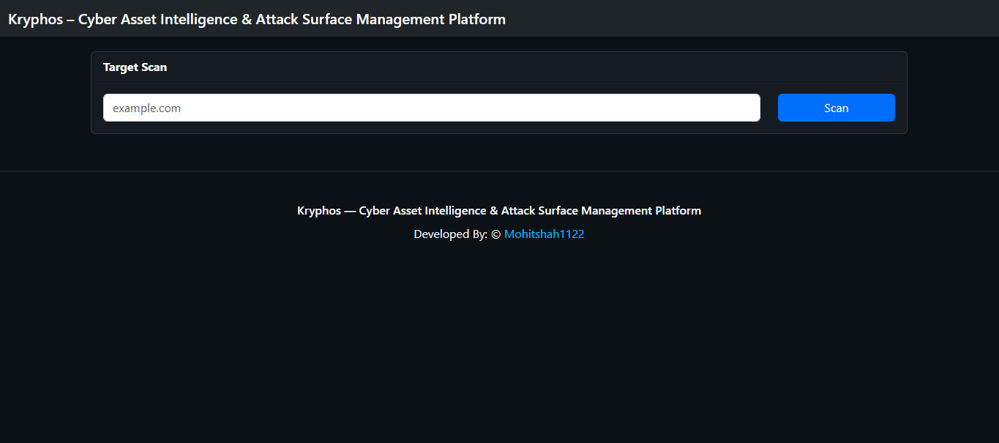
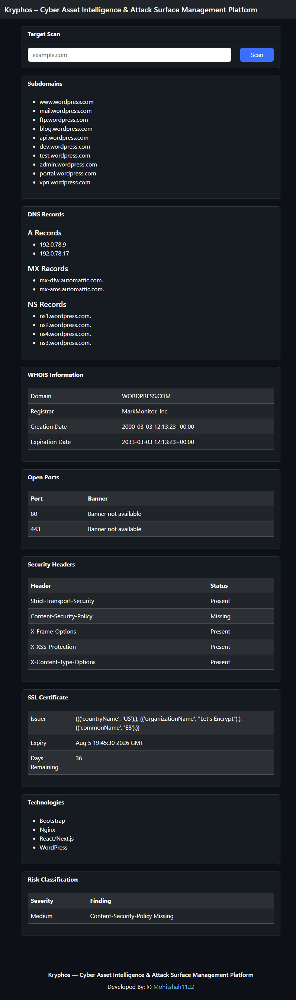
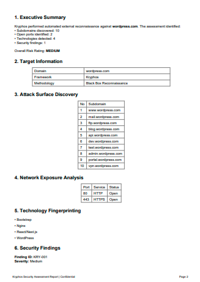

# KRYPHOS

### Hidden Intelligence

> **KRYPHOS** means **"Hidden Intelligence"** — discovering hidden digital assets, exposed services, and attack surfaces across cyberspace.

### Cyber Asset Intelligence & Attack Surface Management (ASM) Platform


---

# 📌 Overview

**KRYPHOS** is a Python and Flask based **Attack Surface Management (ASM)** platform that automates cybersecurity reconnaissance.

The platform helps security professionals and learners identify publicly exposed digital assets, discover subdomains, perform DNS reconnaissance, scan open ports, identify web technologies, and generate professional VAPT-style assessment reports.

KRYPHOS is built using modular architecture, making it easy to extend with additional cybersecurity modules in the future.

---

# 🎯 Project Objective

The primary objective of KRYPHOS is to automate external reconnaissance and attack surface discovery using ethical cybersecurity techniques.

It simplifies information gathering by collecting publicly available information, analysing exposed assets, and presenting the findings in a structured professional report.

---

# 🚀 Features

- 🌐 Subdomain Enumeration
- 🔎 DNS Reconnaissance
- 📡 Open Port Discovery
- 🖥 Service Enumeration
- 🧩 Technology Fingerprinting
- ⚠ Basic Security Risk Identification
- 📄 Automated PDF Report Generation
- 📋 Professional VAPT-style Reports
- 🏗 Modular Python Architecture
- 💻 Simple Flask Web Interface

---

# ⚙️ How KRYPHOS Works

The system follows a structured reconnaissance workflow.

```
User Input
      │
      ▼
Target Domain
      │
      ▼
Subdomain Enumeration
      │
      ▼
DNS Reconnaissance
      │
      ▼
Open Port Discovery
      │
      ▼
Technology Detection
      │
      ▼
Security Analysis
      │
      ▼
PDF Report Generation
```

---

# 🧠 How KRYPHOS Performs Its Tasks

KRYPHOS combines multiple cybersecurity techniques to automate reconnaissance.

### 🔹 OSINT (Open Source Intelligence)

Collects publicly available information about the target.

### 🔹 DNS Reconnaissance

Retrieves DNS records and domain information.

### 🔹 Network Scanning

Discovers open ports and running services.

### 🔹 Technology Fingerprinting

Identifies technologies using HTTP headers and web responses.

### 🔹 Python Automation

Coordinates all reconnaissance modules and processes the results.

### 🔹 ReportLab

Generates professional PDF security assessment reports.

---

# 🛠 Technology Stack

## Backend

- Python
- Flask

## Frontend

- HTML
- CSS
- Bootstrap

## Cybersecurity

- OSINT Techniques
- DNS Reconnaissance
- Network Scanning
- Attack Surface Analysis

## Report Generation

- ReportLab

---

# 📂 Project Structure

```text
KRYPHOS/
│
├── app.py
├── config.py
├── requirements.txt
├── README.md
├── .gitignore
│
├── modules/
│   ├── dns_recon.py
│   ├── subdomain_enum.py
│   ├── port_scanner.py
│   ├── technology_detector.py
│   ├── pdf_generator.py
│   ├── logger.py
│   └── helpers.py
│
├── templates/
│
├── static/
│   └── css/
│
├── reports/
│
└── uploads/
```

---

# 📄 Generated Report Includes

The automatically generated report contains:

- Executive Summary
- Target Information
- Subdomain Discovery
- DNS Information
- Open Port Analysis
- Running Services
- Technology Detection
- Security Findings
- Risk Classification
- Assessment Summary

---

# 💡 Use Cases

- Attack Surface Management (ASM)
- External Reconnaissance
- Cybersecurity Learning
- Security Assessment
- VAPT Practice
- Academic Projects
- Internship Demonstrations
- Portfolio Projects

---

# 📈 Future Enhancements

- WHOIS Lookup
- SSL Certificate Analysis
- CVE Mapping
- Vulnerability Database Integration
- SQLite Database Support
- Dashboard Analytics
- API Integrations
- Graph-based Asset Visualization
- Multi-threaded Scanning
- Export Reports in Multiple Formats

---

# 📷 Project Screenshots

## 🏠 Home Page



---

## 🔍 Scan Results



---

## 📄 Generated PDF Report



---

# ⚠ Disclaimer

KRYPHOS is developed strictly for **educational, research, and ethical cybersecurity purposes only**.

The platform should only be used on systems or domains for which explicit authorization has been obtained.

Unauthorized scanning or testing of third-party systems is strictly prohibited.

---

# 👨‍💻 Author

## Mohit U Shah

Cybersecurity Enthusiast • Python Developer • Ethical Hacking Learner

---

# 📜 License

This project is licensed under the **MIT License**.

---
